# Study Buddy - Chat & Video Call

Study Buddy - Chat & Video Call is a web application that provides users with the ability to chat and have video calls for studying purposes. This application offers a seamless platform for students to connect with their peers, discuss topics, share resources, and collaborate remotely.

## Table of Contents

- [Features](#features)
- [Getting Started](#getting-started)
- [Technologies Used](#technologies-used)
- [Screenshots](#screenshots)
- [Contributing](#contributing)
- [Contact](#contact)

## Features

- **Chat**: Exchange messages with other users in real-time.
- **Users**: View and manage the list of users connected to the chat.
- **Block User**: Block specific users to prevent further communication.
- **Group**: Create or join groups for collaborative discussions.
- **Group Details**: View and manage group information, members, and settings.
- **Audio Call**: Initiate or join audio calls with other participants.
- **Audio Options**: Adjust audio settings during audio calls.
- **Video Call**: Initiate or join video calls with other participants.
- **Video Options**: Adjust video settings during video calls.
- **Layout Options**: Customize the layout of the chat and video call interface.
- **Virtual Background**: Apply virtual backgrounds during video calls.
- **Recording**: Record video calls for later review or sharing.
- **Screen Sharing**: Share your screen with other participants during video calls.

## Getting Started

To get started with Study Buddy - Chat & Video Call, follow these steps:

1. Visit the application at [https://studybuddy-chat-videocall.netlify.app/chatui](https://studybuddy-chat-videocall.netlify.app/chatui).
2. Enter your username and launch the chat.
3. Once logged in, you can initiate or join video calls with other participants.
4. Use the chat feature to communicate with other users during video calls or for general messaging.
5. Create or join groups based on your subjects or topics of interest.
6. Collaborate with group members through separate video calls and chat sessions.
7. Take advantage of the screen sharing and file sharing functionalities for enhanced collaboration.

## Technologies Used

Study Buddy - Chat & Video Call is built using the following technologies:

- **Front-end**: HTML, CSS, JavaScript
- **Video Call**: CometChat
- **Chat**: CometChat
- **UI Framework**: Bootstrap
- **Deployment**: Netlify

## Screenshots

Here are some screenshots showcasing the Study Buddy Chat & Video Call application:

1. **Chat**: 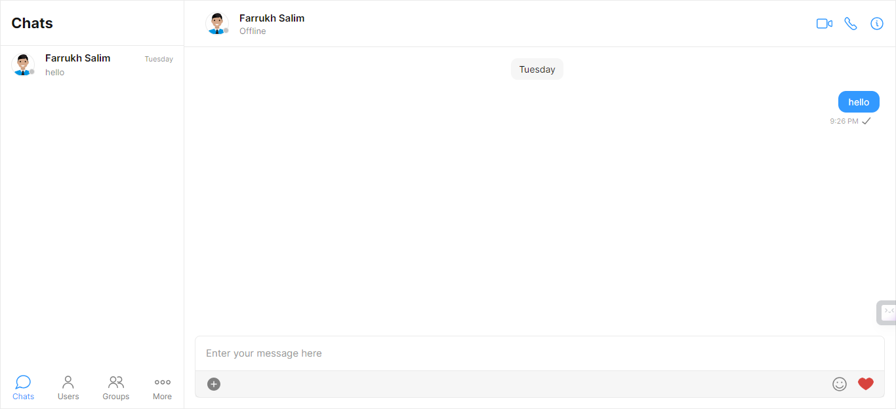
   *The chat interface allows users to exchange messages in real-time.*

2. **Users**: 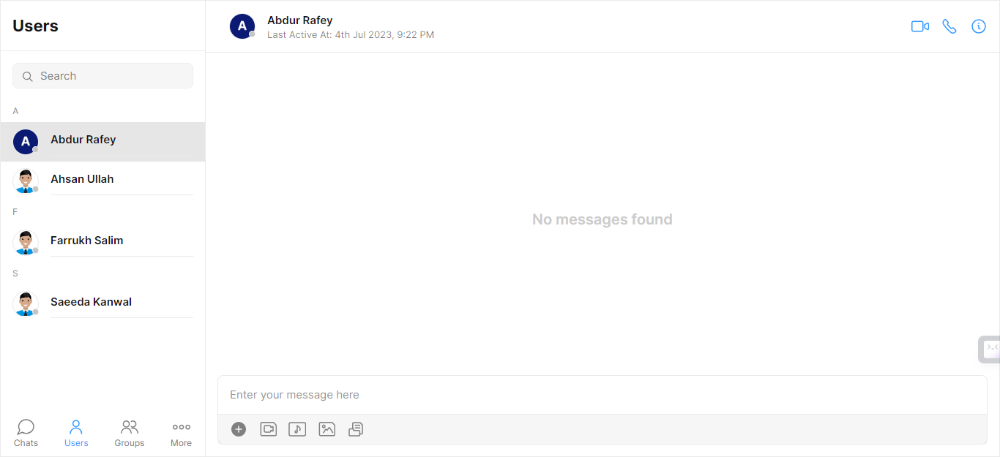
   *The users section displays the list of users connected to the chat.*

3. **Block User**: 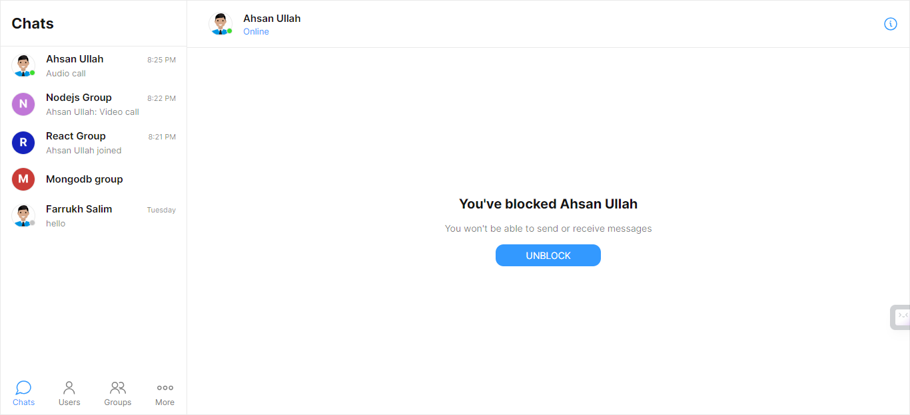
   *Users can block specific users to prevent further communication.*

4. **Group**: 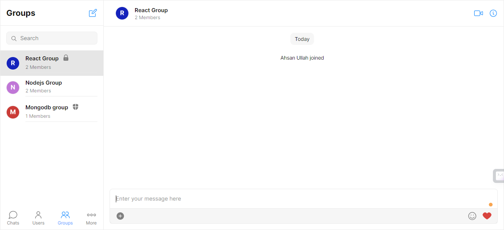
   *Users can create or join groups for collaborative discussions.*

5. **Group Details**: 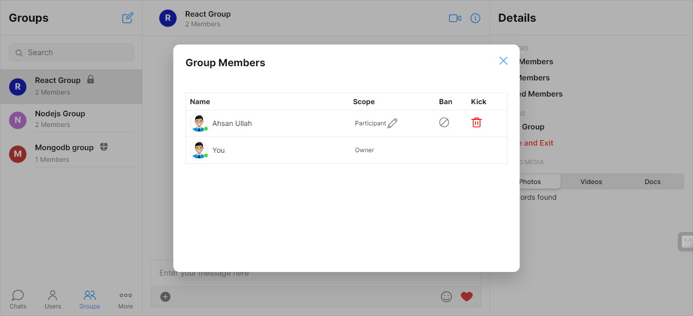
   *The group details section provides information about the group, its members, and settings.*
   
6. **Audio Call**: 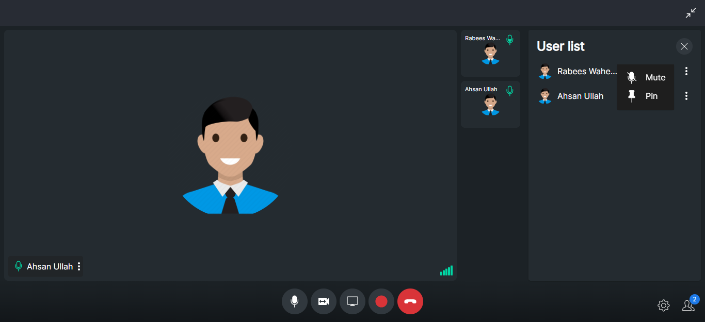
   *Users can engage in real-time voice conversations with other participants.*

7. **Audio Options**: 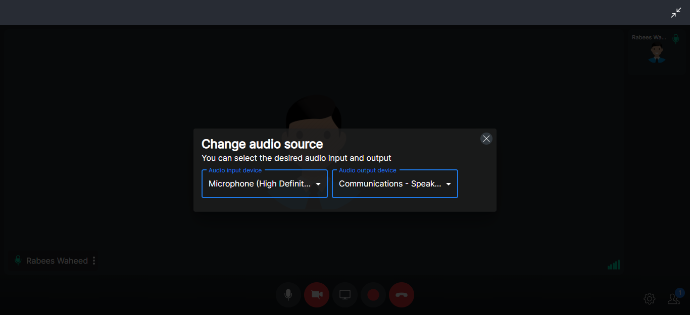
   *Users have the ability to adjust various audio settings during audio calls for optimal communication.*

8. **Video Call**: 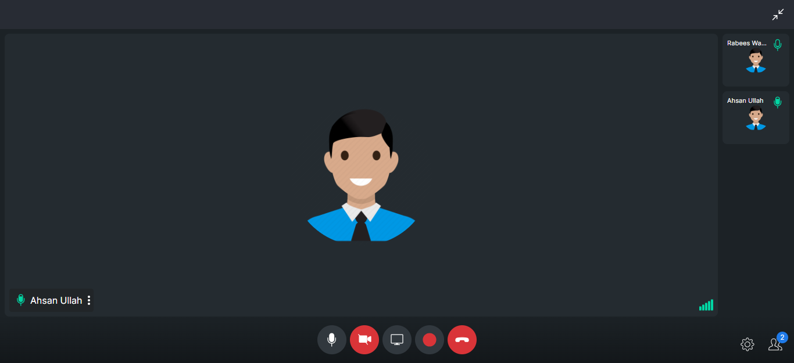
   *Users can engage in real-time video conversations with other participants for collaborative study sessions.*

9. **VideoOptions**: 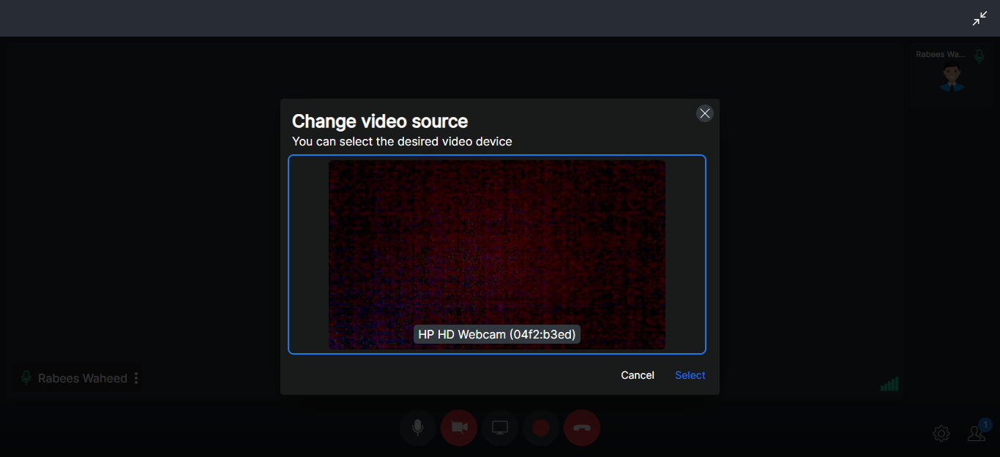
   *Users have the flexibility to customize and adjust various video settings during video calls.*

10. **Layout Options**: 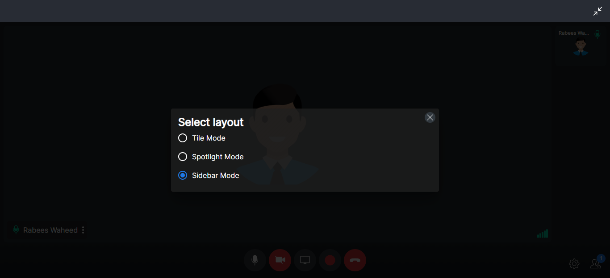
    *Users can personalize the layout of the video call interface according to their preferences and needs.*

11. **Virtual Background**: 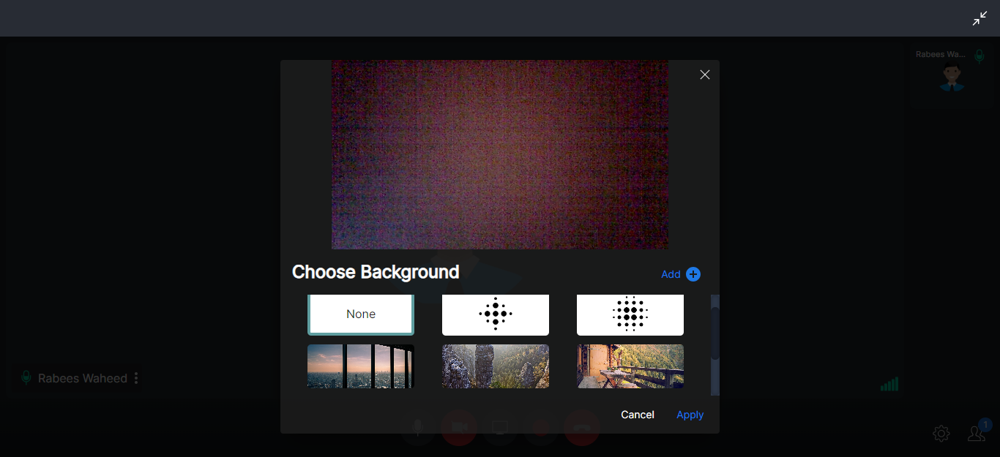
    *Users have the option to apply virtual backgrounds during video calls to enhance their visual appearance and create a professional environment. This feature allows users to choose from a selection of pre-defined virtual backgrounds or upload their own custom backgrounds.*

13. **Recording**: 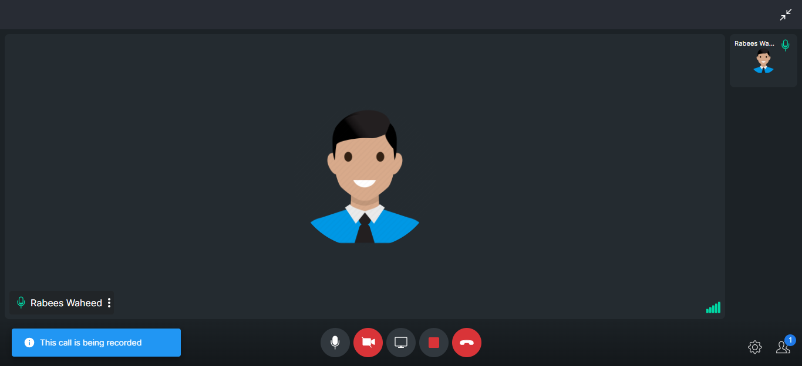
    *Users can record their video calls for later review, sharing, or reference purposes.*

14. **Screen Sharing**: 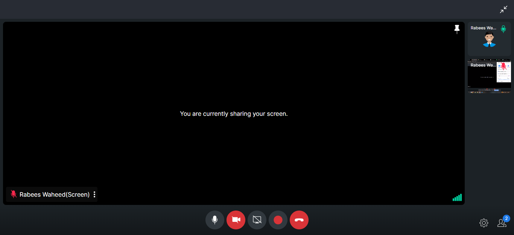
    *Users can share their screens with other participants during video calls, allowing them to present slides, documents, or any other content directly from their devices.*
    
## Contributing

If you would like to contribute to Study Buddy - Chat & Video Call, follow these steps:

1. Fork the repository on GitHub.
2. Clone your forked repository to your local machine.
3. Create a new branch and make your changes.
4. Test your changes thoroughly.
5. Commit your changes and push them to your forked repository.
6. Submit a pull request to the master repository.

Please ensure that your code adheres to the existing code style and conventions. Include appropriate documentation and tests for any new features or changes.

## Contact

If you have any questions, suggestions, or issues regarding Study Buddy - Chat & Video Call, please contact the project maintainers at [rabees699@gmail.com](mailto:rabees699@gmail.com).
